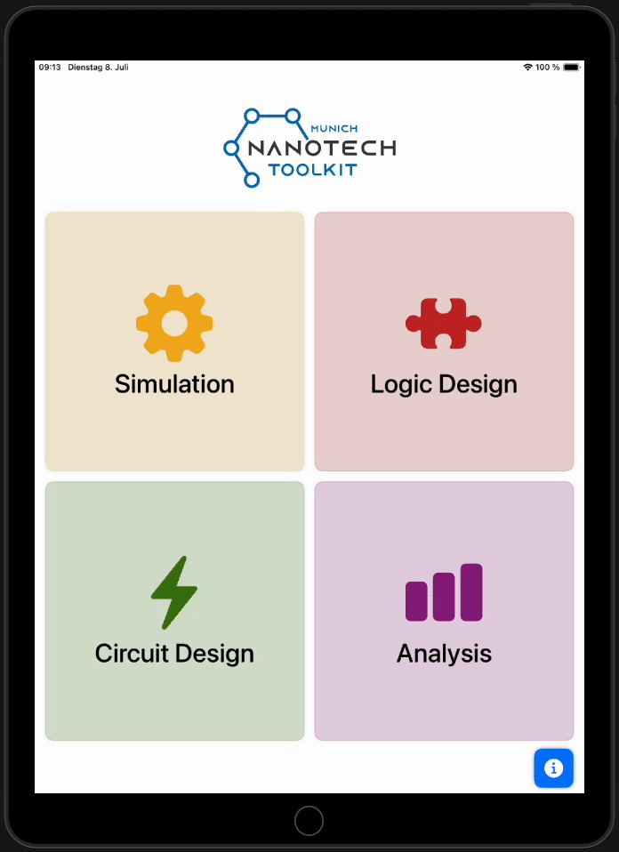

## 📱NanoLogic: An Educational App for Atomic-Scale Computing

[](https://swift.org)
[](https://developer.apple.com/xcode/)
[](https://github.com/Drewniok/NanoLogic/actions/workflows/ios.yml)



NanoLogic is an iOS app designed to deepen your understanding of atomic-scale computing, with a focus on Silicon Dangling Bonds (SiDBs). The app is divided into four main sections, each exploring a unique aspect of the SiDB technology:

1. **Simulation:** Explore the physical simulation of Silicon Dangling Bonds to understand their behavior and properties.
2. **Logic Design:** Learn how to design logic gates using SiDBs.
3. **Analysis:** Analyze the designed gates and evaluate their performance.
4. **Circuit Design:** Build and test circuits based on SiDBs, considering the impact of defects.

## 📥 Get NanoLogic

NanoLogic is available for download on the [Apple App Store](https://apps.apple.com/de/app/nanologic/id6745813509). Install it on your iPhone or iPad to start exploring atomic-scale computing with Silicon Dangling Bonds!

## 🚀 Features

- Interactive simulation of SiDBs at the atomic scale
- Visual logic gate design and editing
- Performance analysis tools for custom logic gates
- Circuit builder with defect modeling
- Modern Swift 5.8 codebase, built with Xcode 16.3
- Continuous integration for iOS builds

## 📲 Installation (For Developers)

1. Clone the repository:
   ```sh
   git clone https://github.com/cda-tum/NanoLogic.git
2. Open `NanoLogic.xcodeproj` in Xcode 16.3 or newer.
3. Select your target device or simulator.
4. Build and run the app.

## 🛠️ Requirements

* macOS with Xcode 16.3+
* iOS 15.0+ device or simulator

## 🤝 Contributing

Contributions are welcome! Please fork the repository and submit a pull request. For major changes, open an issue first to discuss what you would like to change.

1. Fork the repo
2. Create your feature branch (`git checkout -b feature/AmazingFeature`)
3. Commit your changes (`git commit -am 'Add some AmazingFeature'`)
4. Push to the branch (`git push origin feature/AmazingFeature`)
5. Open a pull request

## 📄 License

This project is licensed under the MIT License. See the `LICENSE` file for details.
