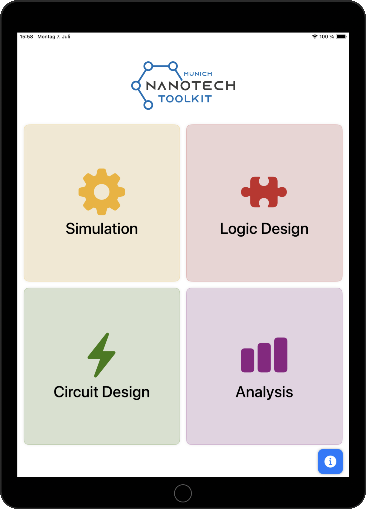

# 📱*NanoLogic* 

NanoLogic is an iOS app designed to deepen your understanding of atomic-scale computing, with a focus on Silicon Dangling Bonds (SiDBs). The app is divided into four main sections, each exploring a unique aspect of SiDB technology:

1. **Simulation:** Explore the physical simulation of Silicon Dangling Bonds to understand their behavior and properties.
2. **Logic Design:** Learn how to design logic gates using SiDBs.
3. **Analysis:** Analyze the designed gates and evaluate their performance.
4. **Circuit Design:** Build and test circuits based on SiDBs, considering the impact of defects.